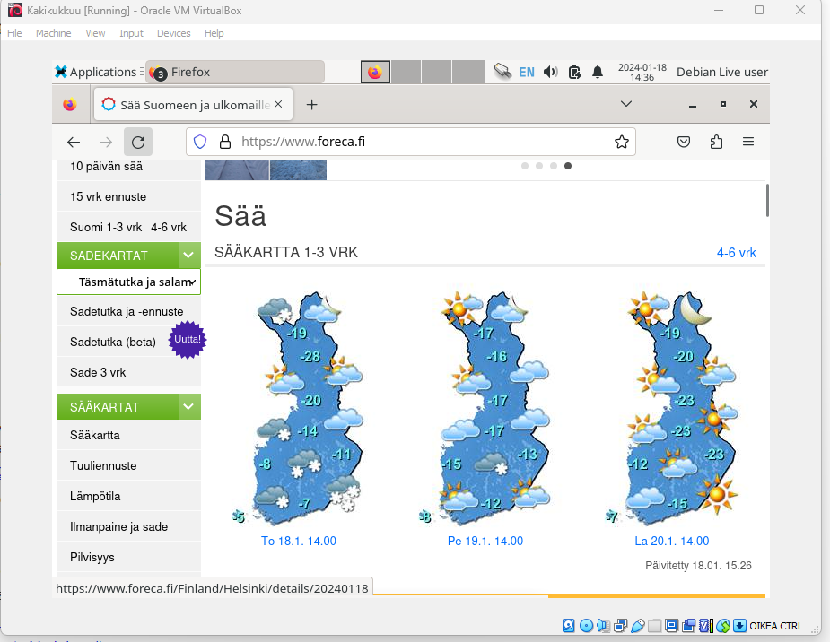

# Oma Linux

## Valmistelu
Raportin kirjoittaminen alkaa samalla, kun tehtävään ja ohjeisiin tarkempi perehtyminen. 18.1.2023 klo 15:30. Kurssi Linux-Palvelimet ICI003AS2A-3004. Tehtävänanto https://terokarvinen.com/2024/linux-palvelimet-2024-alkukevat/.
Käytössä oleva tietokone on Windows 11 Home käyttöjärjestelmällä oleva kannettava tietokone. Tehtävän suorituspaikkana toimii koti, ja tällä hetkellä käytössä on mobiilidatayhteys, joka on jaettu puhelimen kautta.

## Artikkelien tiivistelmät
### Raportin kirjoittaminen (Karvinen, T. 2006)
- Raportti kirjoitetaan täsmällisesti samaan aikaan, kun tehtävää suoritetaan.
- Raportin tulee olla toistettavissa. Samat ongelmat tulee tapahtua, mikäli raportin mukaan joku toinen suorittaa testausta
- Raportin tulee olla täsmällinen. Raportin sisältöön kuuluu täsmälliset komennot, mitä on tehty, milloin ja kirjata ylös kaikki mahdolliset tapahtumat ja viat.
- Raportin tulee olla helppolukuinen. Raportissa on käytettävä ymmärrettävää kieliasua ja sen tulee olla hyvin jäsennelty väliotsikoineen sekä ulkoasuineen.
- Raportista tulee löytyä lähdeviittaukset.
- Plagiointi sekä sepittäminen raportissa on kiellettyä sekä rangaistavaa.

### FSF: FSF Free Software Definition (FSF. 2024: GNU.org)
- Vapaasti jaettavissa oleva ohjelmisto (free software) tarkoittaa sitä, että sitä voi vapaasti käyttää, kopioida, jaella, muuttaa sekä parantaa. Kiinnitetään eritoten huomiota neljään vapauteen.
- Käyttäjät voivat käyttää ohjelmaa kuten haluavat
- Käyttäjät voivat opiskella ohjelmiston käyttöä sekä muuttaa sitä haluamallaan tavalla, omiin tarkoituksiin sopivaksi. Pääsy lähdekoodiin on edellytys tälle toiminnalle.
- Käyttäjät voivat vapaasti jakaa ohjelmiston kopioita auttaakseen muita.
- Käyttäjät voivat vapaasti jakaa muutettua ohjelmistoa muille. Pääsy lähdekoodiin on edellytys tälle toiminnalle.

## Tiedoston poistaminen ja uuden luonti
18.1.2023 klo 16.11 huomasin, että unohdin tallentaa raportin .md muodossa. Tiedoston tekstin copy, sekä tiedoston poisto, uusi tiedosto ja paste. Uusi tallennus. 
  
## Virtual Boxin ja Debian liven lataus ja asennus
Virtual Box ladattu 16.1.2023 klo 12:36 (virtualbox.org). Debian live 12.4.0 ladattu 16.1.2023 klo 13:54 (https://terokarvinen.com/2021/install-debian-on-virtualbox/?fromSearch=debian)
- 16.17 Virtuaalikoneen luonti. Luonnissa käytetty ohjeita, jotka löytyvät https://terokarvinen.com/2021/install-debian-on-virtualbox/?fromSearch=debian.
- Käyttäjätunnus ja salasana luotu
- 8gb RAM muistia käyttöön
- 4 prosessoriydintä käyttöön
- 50gt kiintolevytilaa käyttöön
- Luonnin jälkeen notification "Can't run guest install". ei toimenpiteitä
- 16:34 Virtuaalikone käynnissä
- 16:35 Hiiri toimii, näppäimistö toimii, internet toimii
- 16:41 kuvakaappaus, kuvan upload repositoryyn ja lisääminen raporttiin.

  

  ## Lopetus
  16:46 Virtuaalikoneen sammutus
  16:47 Tallennus ja tehtävän palautus
  

## Lähteet
- https://www.gnu.org/philosophy/free-sw.html
- https://terokarvinen.com/2006/raportin-kirjoittaminen-4/
- https://terokarvinen.com/2021/install-debian-on-virtualbox/?fromSearch=debian
- https://terokarvinen.com/2024/linux-palvelimet-2024-alkukevat/#h1-oma-linux
- https://www.virtualbox.org/wiki/Downloads 
