# Komentaja Pingviini
Työskentely kesti yli 5 tuntia, kahdessa osassa. Väliin mahtui muutama lyhyt tauko. Komentorivi tuli siinä määrin myös tutuksi, kun liikuin hakemistoissa edes takaisin ja etsin tiedostoja sekä kansioita.

## Käytettävä tietokone
- Asus Tuf Gaming A15 FA506QM kannettava tietokone
- Käyttöjärjestelmä: Windows 11 Home
- Prosessori: AMD Ryzen 7 5800H, 8 ydintä 3200GHz
- Muisti: 16 Gt
- Näytönohjain NVIDIA GeForce RTX 3060 laptop, 6144Mt omalla muistilla

## Command Line Basics Revisited
- Komentorivi on ollut käytössä paljon ennen nettipalveluita. Se on käytännöllinen ja nopea käyttää, ja komentoja on helppo automatisoida.
- Komentorivillä liikutaan aina hakemistoissa
- Risuaitamerkillä # saadaan aikaan komentoriviin kommentti, jonka jälkeen loppu rivistä jätetään huomioimatta
- Komentorivillä voidaan luoda uusia tekstitiedostoja, sekä hakemistokansoita
- Niitä voidaan luomisen jälkeen manipuloida
- Komentorivillä voidaan asentaa ja poistaa ohjelmia
- Komentorivillä voidaan ottaa etäyhteyksiä SSH:lla
- Komentorivillä voidaan nähdä tapahtumien lokitietoja sekä lukea käyttöohjeita
- https://terokarvinen.com/2020/command-line-basics-revisited/?fromSearch=command%20line%20basics%20revisited

## Micron asennus
Micro on kätevän oloinen tekstieditori, joka tuli asenneltua jo edellisellä tunnilla kissa ja koira tekstitiedostoja luodessa. Kaiken työskentelyn alkasessa on kuitenkin aloitettava komennolla "sudo apt-get update" joka päivittää kaikki paketit. Vasta tämän jälkeen tehdään ohjelmien asennus. (Karvinen, T.) https://terokarvinen.com/2020/command-line-basics-revisited/?fromSearch=command%20line%20basics%20revisited

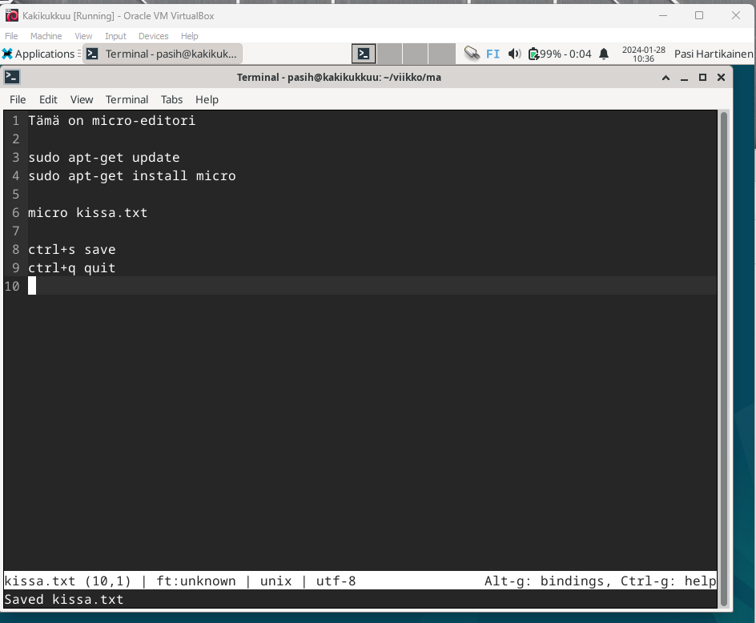

## Rauta
Ennen sudo lshw -short -sanitize komentoa jouduin asentamaan lshw:n (list hardware). Se tapahtui sudo apt install lshw -komennolla. Itse listaus esittelee käytössä olevan raudan sekä siihen sisältyvät verkkokortit ja virtuaalikoneen integraatiot, kuten hiiren.

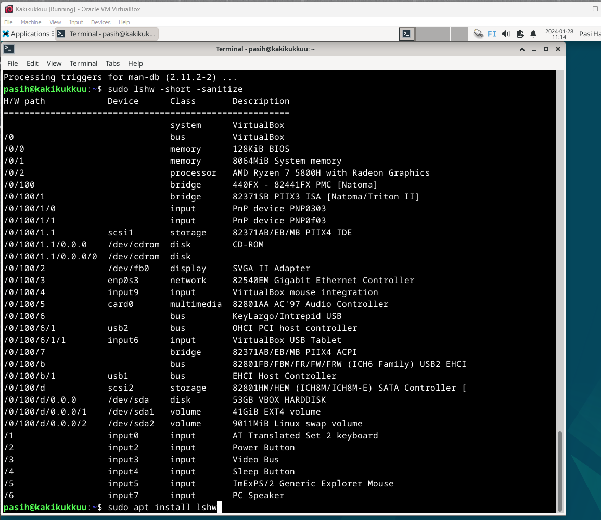

## Apt - komentoriviohjelmien asennus
Useamman ohjelman asennus kerralla vaatii komennon sudo apt-get install ohjelma1 ohjelma2 ohjelma3. Ideoita ohjelmiin osoitteessa https://medium.com/@gurpreet.singh_89/15-fun-linux-command-line-programs-to-spice-up-your-terminal-abf30af73de1

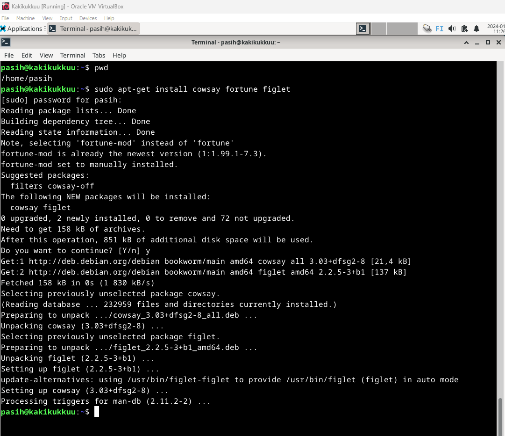

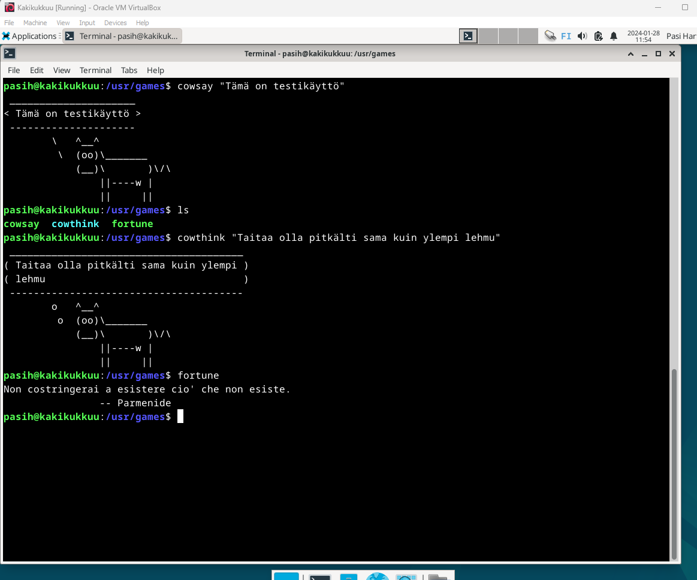

## FHS - Important directories
### / root directory
Kaiken alku-ja juurihakemisto. Pääsy komennolla cd /. ls komennolla saa näkyviin kaiken, mitä hakemistot sisältävät. Juurihakemiston kautta pääsee porautumaan hakemistossa minne vain.

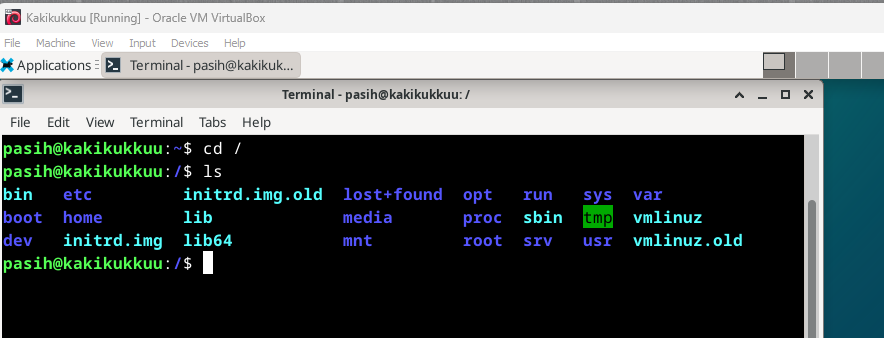

### /home/
Käyttäjien kotihakemistot. Sisältää oman kansioni

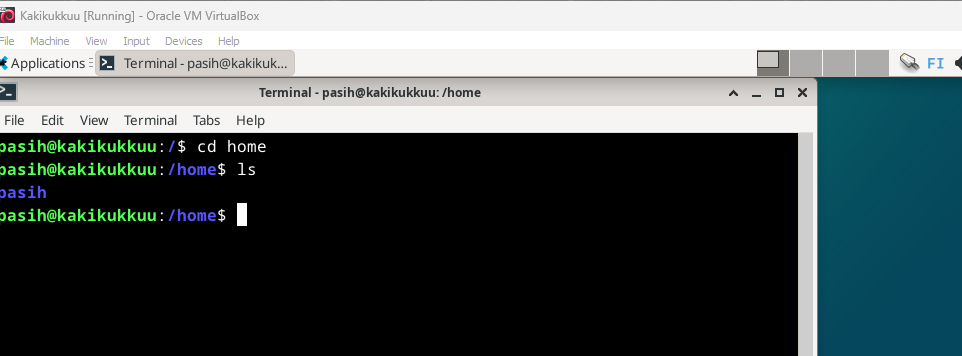

### /home/pasih/
Kotihakemisto käyttäjälle pasih. Ainut paikka, mihin käyttäjä voi tallentaa dataa pysyvästi. Aiemman tunnin kissa ja koira tiedostot löytyvät täältä, kun porautuu eteenpäin.

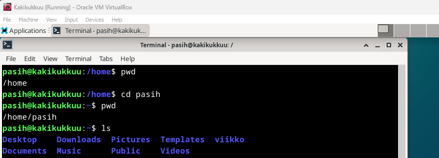

### /etc/
Tekstitiedostoja, systeemin asetukset löytyvät täältä. Jälkimmäisessä kuvassa profile-tiedosto less komennolla luettavissa.

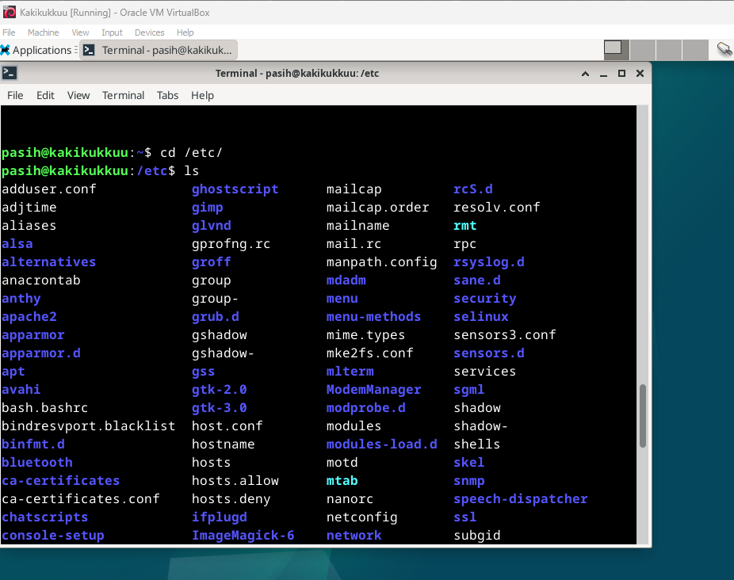

### /media/
Sisältää tiedot, jos koneessa olisi kiinni muistitikku, tai asemassa cd/dvd -levy. Nyt ei ole, joten kansiot on tyhjänä.

### /var/log/
Sisältää systeemin lokitiedot.

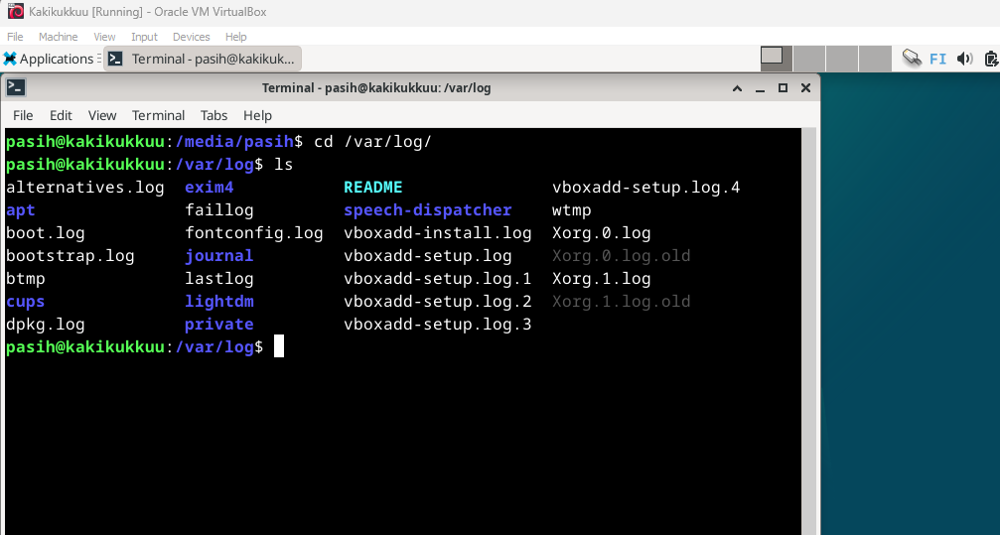

## The Friendly M
Grep - komentoa käytetään etsimään yhtäläisyyksiä joko tiedostokansioista tai itse tiedostoista. Sillä voidaan siis etsiä esimerkiksi tiettyjä sanoja eri tavoilla (Hostinger tutorials. https://www.hostinger.com/tutorials/grep-command-in-linux-useful-examples/) Alla muutama komentoesimerkki grepin käytöstä.

### grep --help -> ohjeet

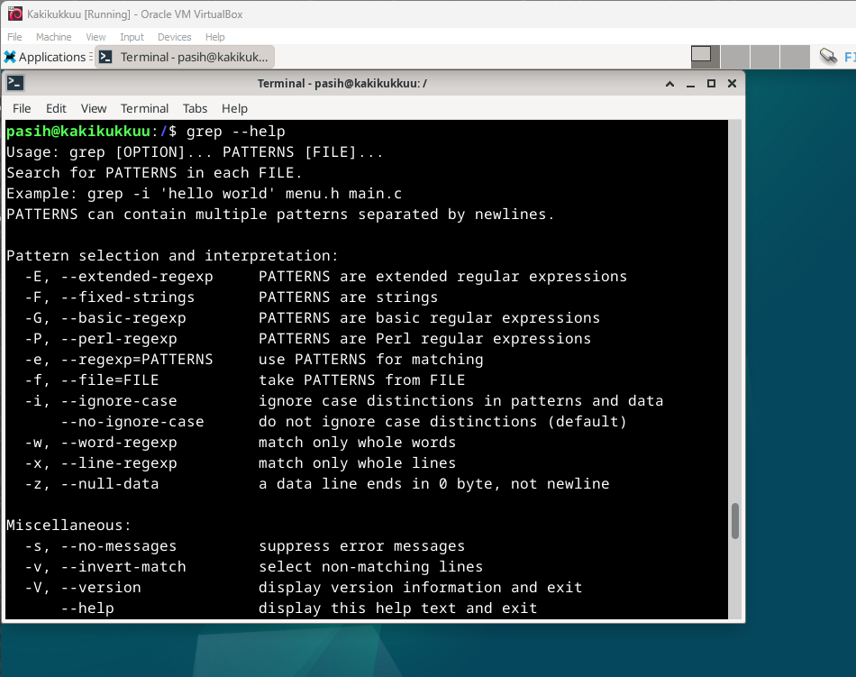

### grep query viikko -> etsitään tiedostokansio jonka nimessä on viikko

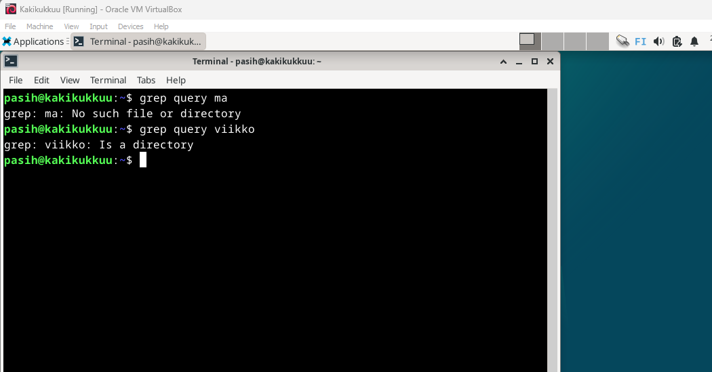

### grep micro kissa.txt -> etsitään lauseet, joissa micro mainittu

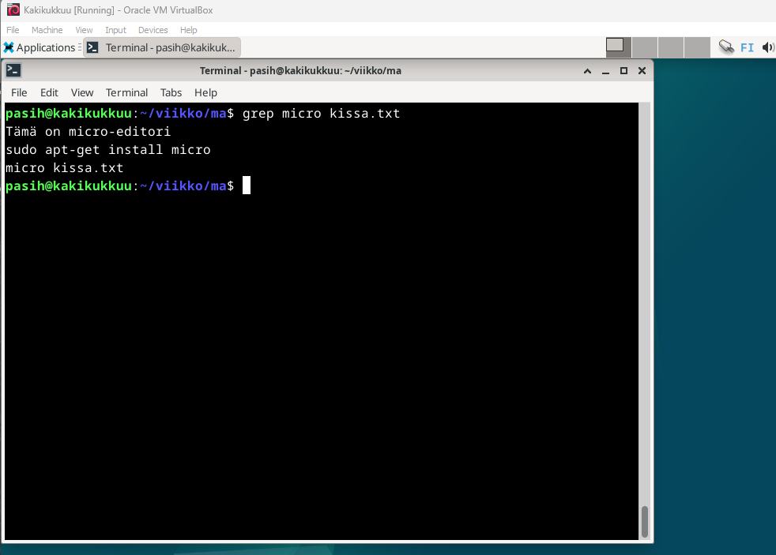

## Putki, pipe

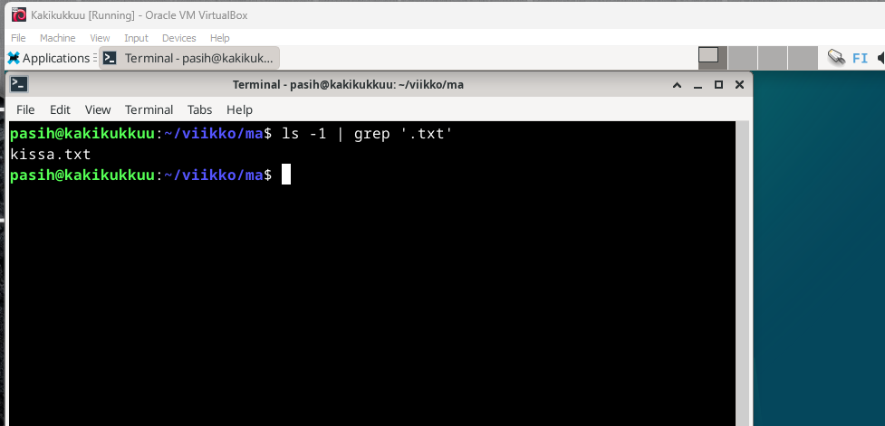

## Lähteet
- Hostinger Tutorials. https://www.hostinger.com/tutorials/grep-command-in-linux-useful-examples/
- Karvinen, T. Command Line Basics Revisited https://terokarvinen.com/2020/command-line-basics-revisited/?fromSearch=command%20line%20basics%20revisited
- Karvinen, T. Tehtävänannot. https://terokarvinen.com/2024/linux-palvelimet-2024-alkukevat/
- Singh, G. 2023. https://medium.com/@gurpreet.singh_89/15-fun-linux-command-line-programs-to-spice-up-your-terminal-abf30af73de1
