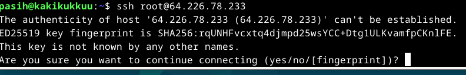
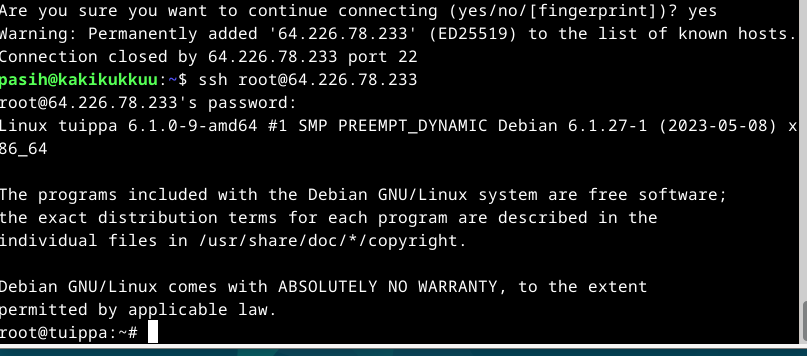
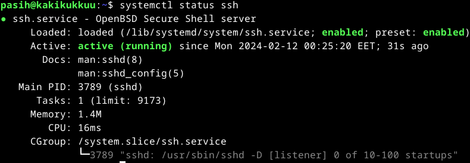
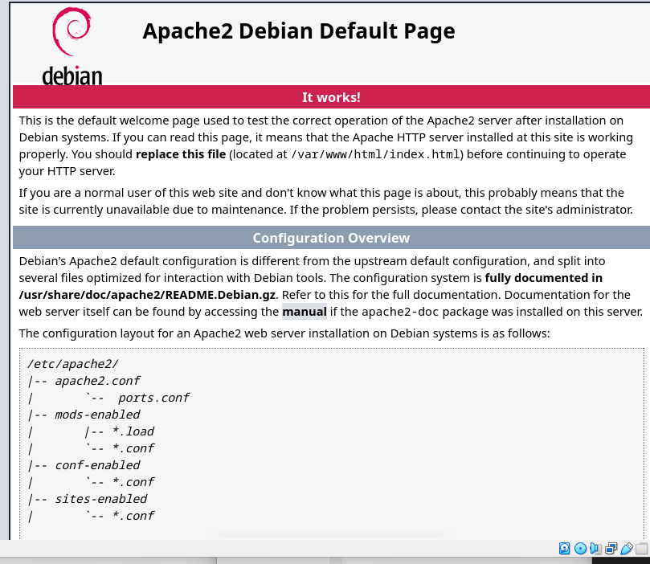
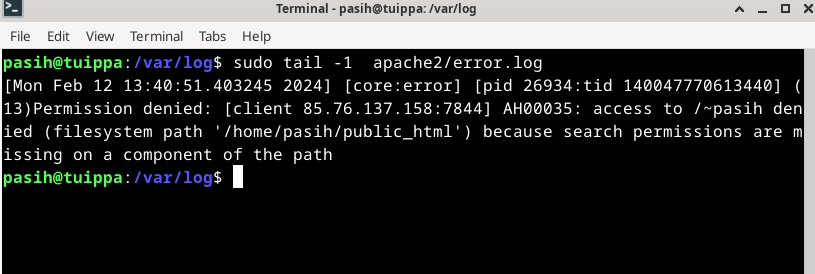
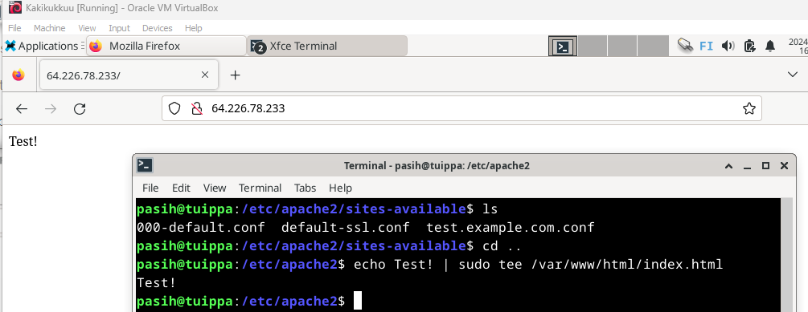
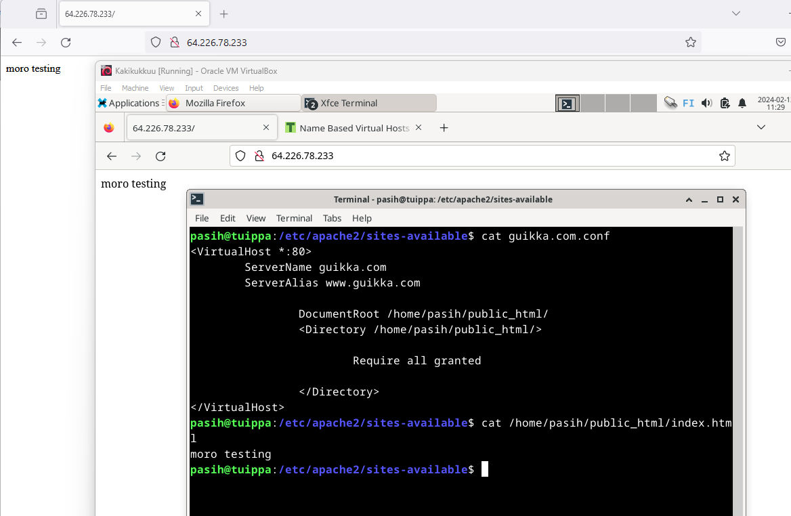
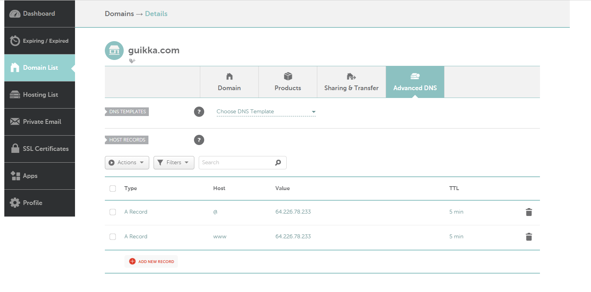

# Maailma kuulee

Tällä kertaa tutustun virtuaalipalvelimen vuokraamiseen, sekä web-palvelimen asennukseen sille. Tavoitteena on saada julkinen netissä näkyvä sivu aikaiseksi. Lisäksi sille on tarkoitus vuokrata nimi. Katsotaan mitä tulee, työskentely alkaa kotioloissa 11.2.2024 klo 22.45. Muutaman tupakkatauon ja tulleen errorin jälkeen klo 2:37 on hyvä lopettaa.

## Käytössä oleva rauta
### Host OS
- Asus Tuf Gaming A15 FA506QM kannettava tietokone
- Käyttöjärjestelmä: Windows 11 Home
- Prosessori: AMD Ryzen 7 5800H, 8 ydintä 3200GHz
- Muisti: 16 Gt
- Näytönohjain 6144Mt omalla muistilla
- Nettiyhteys taloyhtiön ethernet
### Guest OS- pyörii VirtualBoxin kautta
- Debian, 64-bit
- 4 prosessoriydintä
- 7981 Mt RAM

## Teoriasta käytäntöön
- Netistä voi vuokrata oman julkisen palvelimen. Nimenvuokraamalla voi osoittaa nimellä omaan palvelimeen
- Palvelin on syytä suojata palomuurilla hyökkäyksien hidastamiseksi
- Palvelimelle voidaan asentaa web-palvelin, tässä tapauksessa apache
- Palvelimen toimivuus varmistetaan päivittämällä kaikki palvelimen aplikaatiot
- (Lehto, S. 2022)
- Painokkaasti: Käytä aina pelkästään hyviä salasanoja! Salasanojen huonous johtaa helpommin tunkeutumisiin ja rikolliseen toimintaan
- Palvelimet, ja nimipalvelimet ovat kovasti kilpailtuja markkinoilla ja tarjolla on useita palveluntarjoajia
- SSH:lla otetaan etäyhteys vuokrattuun palvelimeen, omasta virtuaaliympäristöstä (tai raudalle asennetusta linuxista)
- Vuokrattu palvelin vaatii käyttäjien määrityksen
- Root-tunnus tulee sulkea
- Päivitykset, sekä palumuuri ovat ehdottomia. Palomuuriin tulee sallia SSH sekä paikallinen porttiyhteys, jotta palvelinta voidaan käyttää.
- (Karvinen, T. 2017)

## Virtuaalipalvelimen vuokraus
Tero Karvisen materiaalien, sekä sekä edellisen oppitunnin perusteella päätin valita palveluntarjoajaksi materiaaleissakin löytyvän DigitanOceanin. Rekisteröinti sujuu aika mutkattomasti, mutta luottokortin lisäämisessä mainittu euron arvoinen liittymismaksu, sekä palvelun käyttötarkoituskysely ovat hieman häiritseviä. Enhän vielä ole ostanut mitään, kortiltani veloitetaan euro (vaikkakin lupauksen kera palauttaa katevaraus viikon sisällä). Joka tapauksessa, jatkan "Dropletien" kimppuun. Dropletit ovat älytön nimitys DigitalOceanille kutsua virtuaalikoneitaan. Virtual machine kuulostaisi verrattaen vaivalloiselta? Mutta, tämähän on vain markkinointikikka.

Valitsen virtuaalikoneeni sijainniksi EU-valtio Saksasta löytyvän Frankfurtin, käyttöjärjestelmäksi Debian 12, 64bit. Valitsen halvemmasta päästä olevan yhden prosessoriytimen, 25 gigan koneen. Mainiota! Tällä on hyvä lähteä eteenpäin. Sitten onkin aika valita root salasana, SSH määritellään myöhemmin. Mieleeni muistuu, että salasanan on oltava oikeasti vahva! Ja tottakai valitsen kaikki mahdolliset lisäpalvelut ja maksan itseni kipeäksi (en kai sentään). Muistan kuitenkin antaa hostnameksi simppelin nimen, jolla ei ole jäljitettävyyttä esimerkiksi käytettävään OS:ään. Sitten kliksuttelun jälkeen oma söötti droplettini onkin jo käynnissä. Siistiä!

## Aika ensimmäiselle yhteydelle
Tässä kohdassa starttaan ensimmäistä kertaa oman paikallisen virtuaalikoneeni ja avaan terminaalin. Tarkoituksenani on ottaa yhteys paikalliselta virtuaalikoneeltani Frankfurtissa sijaitsevaan vastavuokrattuun koneeseen. Tämä tapahtuu SSH (secure shell) protokollalla. Se tapahtuu ensimmäisellä kerralla komennolla `ssh root@ip.osoite`. IP-osoite on näkyvissä DigitalOceanin sivuilla.

Tässä kohtaa meinasi mennä sormi suuhun. `bash: ssh: command not found` ?? Googletin asiaa, ja päädyin asentamaan ssh-serverin. Komento oli `sudo apt install openssh-server` (Linuxcapable). Ennen tätä vaadittiin kuitenkin päivitysten ajo palvelimelle `sudo apt-get update`ja `sudo apt-get upgrade`. Vasta päivityksen jälkeen pystyy asentelemaan ohjelmia, ja se on tehtävä päivittäin. Tämän jälkeen tsekkasin SSH statuksen `systemctl status ssh`.

ja koitin ottaa roottiyhteyttä uudestaan. Siinä kohtaa kysyttiin otetaanko yhteys.

Ja onnistumisen riemua! Sisällä ollaan.

## Palvelimen alkutoimet
Tässä kohtaa tulee (sudo uft allow 22/tcp, jonka pitäisi sallia ssh protokolla) seuraava virhe. `bash: utf: command not found`. palomuuria ei siis löydy valmiina tältä koneelta, joten asennetaan se `sudo apt install uft`. Johan toimii ja matka jatkuu.
- `sudo ufw allow 22/tcp` -> avataan ssh:lle palomuuriportti
- `sudo ufw enable` -> palomuuri päälle 
- `sudo adduser pasih` -> käyttäjän lisääminen. Tässä kohtaa kysellään nimet ja muut. Nimen annan.
- `sudo adduser pasih sudo` -> pääkäyttäjäoikeuksien antaminen
- tämän jälkeen olisi tarkoitus sulkea root-yhteys, mutta ensin testataan toimivuutta: otetaan toisella terminaalilla yhteys palvelimelle, ja jos se onnistuu luodulla nimellä `ssh pasih@ip.ip` niin johan passaa. Ja passaahan se!
- `sudo usermod --lock root` -> root kirjautumisen sulku

## Apache2 asennus
Jotta julkisen palvelimen saa asennettua virtuaalipalvelimelle, täytyy palomuurille sallia yhteys: `sudo ufw allow 80/tcp`. Tämän jälkeen itse apachen asennus.
- `sudo apt-get install apache2`
- `sudo systemctl enable --now apache2`
- Testi: `http://ip.osoite` tuottaa testimielessä apachen default sivun. Eli palvelin on pystyssä. `curl http://ip.osoite` tuottaa tekstinä myös saman tuloksen.

## Etusivun korvaus
- tehdään konffitiedosto apachen sites-availableen.
- disabloidaan aiempi testisivu ja enabloidaan uusi
- `sudo a2dissite 000-default-ssl.conf` -> `sudo a2ensite test.conf` -> tämän jälkeen `systemctl restart apahce2` ja voila, testisivu on nyt tyhjä.

- Tämän toimenpiteen jälkeen pitää tehdä kansiopolku sinne, mihin test.conf tiedosto vie
- `mkdir -p /home/pasih/publicweb/test.example.com` -> -p luo alikansiot polulle
- pistetään index.html tuonne sisälle
- `systemctl restart apache2`
- ja ei toimi. Vianselvitys alkakoot!!
### Vianselvitys
- `sudo apache2ctl configtest` ei anna mitään järkevää, aika  tutkia errorlogit
- Ei luonnistu. aika lopettaa 02:37

## Updates
- 12.2.2024 klo 14:53 kuvien lisäys
- 12.2.2024 klo 16:10 errorlogia tutkiessa huomaan, että käyttöoikeudet puuttuu. apachen default sivu palautettu näkyville. Ilmeisesti directoryistä johtuvaa säätöä kaipaa, ei olekaan samanmoista asentelua, kuin paikallisesti, jos halutaan julkiseksi.

- käyttöoikeudet annettu käyttäjähakemistoihin, ei apua. `sudo a2enmod userdir`
- luotu kansio käyttäjä/pulic_html ja siirretty index.html sinne
- säädetty konffitiedostoakin, jotta polku kohtaa.
- pistetty `echo "Test!" | sudo tee /....` Aloitussivu päivittyi. Toimii myös toisella koneella.

- Lopetus 12.2.2024 klo 17:30
- Homma jatkuu 13.2.2024. Aloitetaan luomalla uudelleen poistettu .conf tiedosto sudoeditillä, joka myöhemmin kuvassa.
- `sudo a2ensite guikka.com.conf` antaa errorin ja apache kaatuu. Palataan tähän myöhemmin. `systemctl status apache2` näyttää, että palvelin ei vastaa.
- tässä vaiheessa tunnilla opittu asia: lisää others- käyttäjälle x oikeudet käyttäjähakemiston poluille, mistä index.html löytyy `chmod o+x /home/pasih/public_html`
- Palataan vielä apachen toimivuuteen. .conf tiedostosta löytyi typo: `<Directory /home/pasih/public_html/`. Eli > sulku puuttui!
- Lisäsin sulun, ja uusi `sudo systemctl restart apache2`
- Lopputulos kuvakaappauksella, kaikki toimii! YES. Seuraavaksi nimipalvelun kimppuun.

- 16.2.2024 klo 12.10 raportin teko jatkuu
- nimipalvelimeksi valikoitui namecheap.com. DNS guikka.com oli vapaana, se valikoitui vuodeksi vaikka oli hieman kalliimpi.
- laitettu guikka.com osoittamaan DigitalOceanilta vuokratun palvelimen IP-osoiteeseen.

- Testattu kännykän selaimella, virtuaalikoneella sekä PC:n selaimella toimivuus, kun Namecheapilta ilmoitettiin nimen olevan käytössä.

## Lähteet
- Karvinen, T. 2017. First Steps on a New Virtual Private Server. https://terokarvinen.com/2017/first-steps-on-a-new-virtual-private-server-an-example-on-digitalocean/. Luettavissa 11.2.2024
- Karvinen, T. 2024. Tehtävänanto. https://terokarvinen.com/2024/linux-palvelimet-2024-alkukevat/. Luettavissa 11.2.2024
- Lehto, S. 2022. Teoriasta käytäntöön pilvipalvelimen avulla (h4). https://susannalehto.fi/2022/teoriasta-kaytantoon-pilvipalvelimen-avulla-h4/. Luettavissa 11.2.2024
- Linuxcapable. Open SSH. https://www.linuxcapable.com/how-to-install-and-enable-ssh-on-debian-linux/. Luettavissa 12.2.2024

