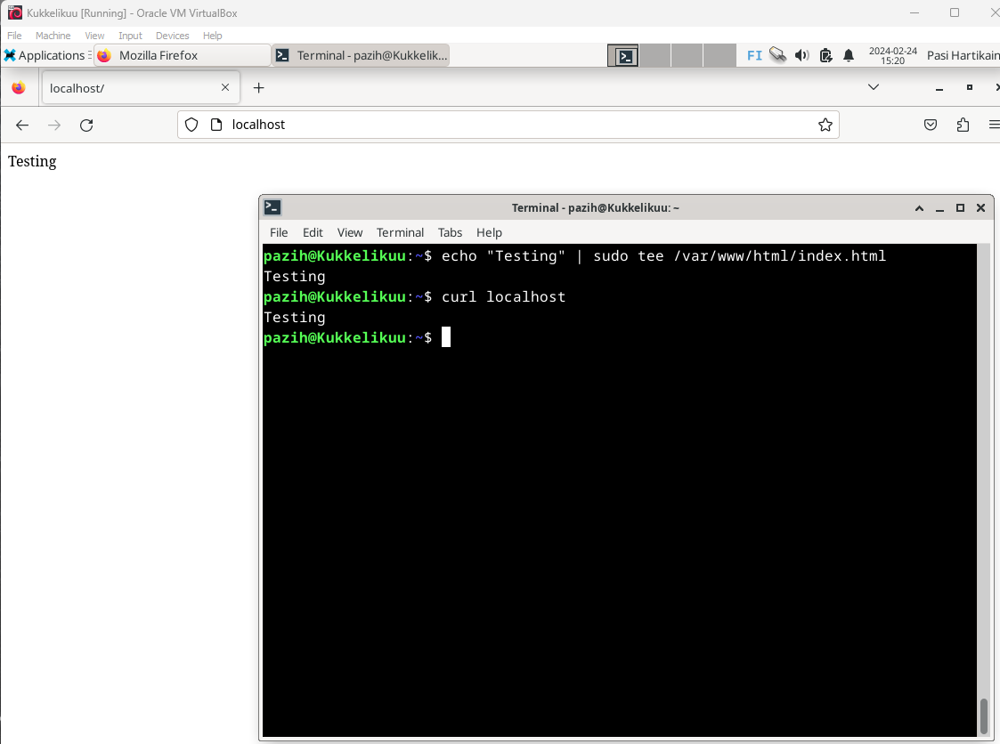

# Koko juttu - alusta alkaen!
Tämän viikon tehtävänä on asennella uusi, tyhjä virtuaalikone, joka alustetaan aiemmin kurssilla tehtyyn tapaan. Virtuaalikoneelle asennellaan web-palvelin sekä SSH-etähallintapalvelin. Webpalvelimelle luodaan uusi kotisivu. Lisäksi kirjautuminen automatisoidaan julkisella SSH-avaimella. Näiden toimien jälkeen tutkitaan domain-nimen tietoja 'host' ja 'dig' komennoilla. Vapaaehtoisena tehtävänä on asentaa Vagrant, jonka avulla on helppo ja nopea luoda uusia virtuaalikoneita. (Karvinen, T. 20214)

Työskentely alkaa kotioloissa, torstai-iltana 22.2.2024 klo 19:05.

## Käytössä oleva rauta
### Host OS
- Asus Tuf Gaming A15 FA506QM kannettava tietokone. Kone on tarkoitettu pelikäyttöön, ja on opiskeluolosuhteisiin ja tarkoitukseen nähden tehokas.
- Käyttöjärjestelmä: Windows 11 Home
- Prosessori: AMD Ryzen 7 5800H, 8 ydintä 3200GHz
- Muisti: 16 Gt
- Näytönohjain 6144Mt omalla muistilla
- Nettiyhteys taloyhtiön ethernet

### Guest OS
- päivitetään myöhemmin, kun uusi virtuaalikone on luotu
- update 22.2.2024 klo 20:27 kts. seuraava vaihe

## Uuden virtuaalikoneen asennus. 22.2.2024 19:10-20:25 suunnilleen 20 minuutin tauolla
- Aloitetaan asentamalla VirtualBoxiin uusi kone. Ohjeita joudun selaamaan https://terokarvinen.com/2021/install-debian-on-virtualbox/.
- Nimi määritetty, asennuksen sijainti asetettu
- ISO kuvake (virtuaalinen asennuslevy) bongattu edellisestä sijainnistaan. 64-bit versio Debianista
- käyttäjänimi ja äärettömän hyvä salasana keksitty
- 4096MB muistia ja 4 prosessoriyhdintä käyttöön
- 50Gt dynaamista kovalevytilaa luodaan (ei varaa tallennustilaa, ellei sille ole tarvetta) -> tässä kohtaa voisin valita kovalevytilan jaettuna aiemmin luodulta virtuaalikoneeltani, mutta luon uuden.
- Vielä uuden virtuaalikoneen settingseistä lyödään boottilevyke sisään (ISO tiedosto) ja menoksi
- Hiiri, näppäimistö ja netti toimii.
- Ajetaan installer työpöydältä ja seurataan ohjeita. Muistetaan hyvä salasana, sekä nimi, joka ei ole tunnistettavissa (se on näkyvillä)

### Komentorivin toimet - ensimmäiset askelet uudella käyttiksellä
- `sudo apt-get update` haetaan päivitykset 
- `sudo apt-get -y dist-upgrade` asennetaan päivitykset (-y vastaa "yes" kaikkiin kysymyksiin asennuksista)
- `sudo apt-get -y install ufw` asennetaan palomuuri ja laitetaan se päälle `sudo ufw enable` --> näiden jälkeen boottaus

  
- resoluution säätämiseksi asennetaan vielä VMGuestBoxAdditions ja käytetään terminaalissa komentoa `sudo bash VBoxLinuxAdditions.run`

- testaus vielä boottauksen jälkeen, että kaikki toimii

## Apache ja SSH asennus 24.2.2024 klo 15:00-
Parin päivän luovan taon jälkeen työskentely jatkuu. Seuraavana on vuorossa web-palvelin Apachen asennus Uudelle virtuaalikoneelle (Karvinen, T. 2018).

- `sudo apt-get update` ja `sudo apt-get -y dist-upgrade` -> Aloitus hakemalla päivitykset .
- `sudo apt-get -y install apache2` -> Asennetaan Apache2 
- `sudo apt-get install micro` -> Asennetaan microeditori helpomman tekstinkäsittelyn takia 
- `curl localhost` sekä webbisivulta http://localhost -> Testataan palvelimen asentuminen . Toimii

- `echo "Testing" | sudo tee /var/www/html/index.html` -> Vaihdetaan etusivun teksti . Toimii

- `EDITOR=micro sudoedit guikka.com.conf` -> Luodaan konffitiedosto /etc/apache2/sites-available -kansioon.

![Add file: Upload]

- `sudo a2ensite guikka.com.conf` -> enabloidaan uusi sivusto
- `sudo a2dissite 000-default.conf` -> disabloidaan defaultsivu
- `sudo systemctl restart apache2`-> bootataan palvelin
- `curl localhost` sekä selaimen refreshaus. So far so good

- `mkdir -p /home/pazih/publicweb/guikka.com/` -> luodaan tiedostopolku alikansioineen
- `echo testausta > /home/pazih/publicweb/guikka.com/index.html` -> vaihdetaan etusivun tekstiä jälleen. Toimii

- 

## Lähteet
- Karvinen, T. 2018. Name Based Virtual Hosts on Apache. https://terokarvinen.com/2018/04/10/name-based-virtual-hosts-on-apache-multiple-websites-to-single-ip-address/
- Karvinen, T. 2021. Debianin asennus. https://terokarvinen.com/2021/install-debian-on-virtualbox/
- Karvinen, T. 2024. Tehtävänanto. https://terokarvinen.com/2024/linux-palvelimet-2024-alkukevat/
