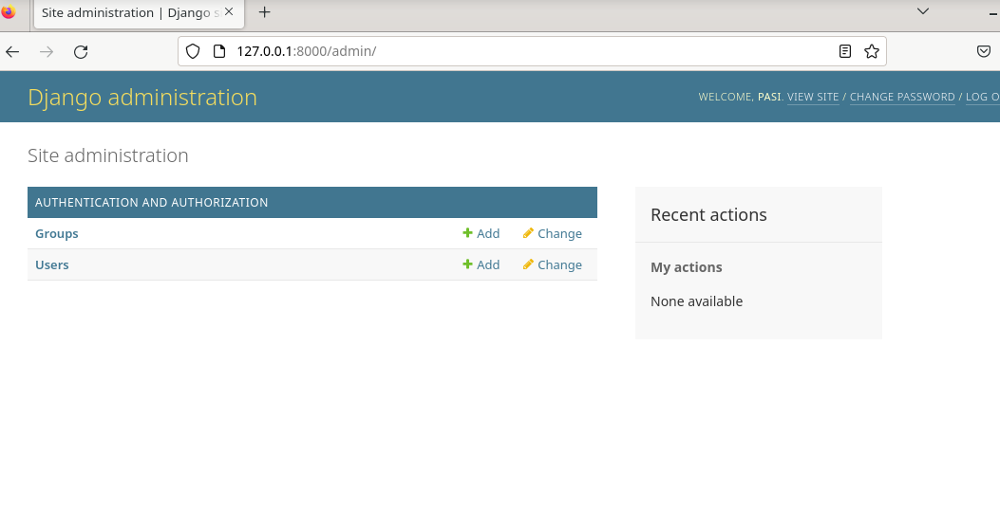
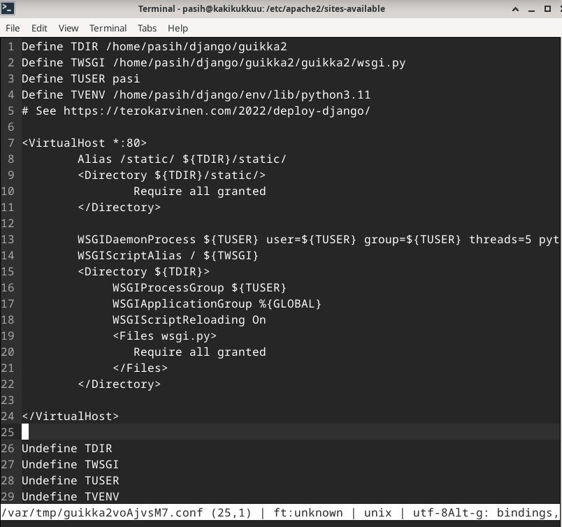

# DJ Ango - Django!!

## Tiivistelmät

### Django 4 Instant Customer Database Tutorial (Karvinen, T. 2021)
- env - virtuaalinen kehitysympäristö, jota käytetään web-kehityksessä
- env:n kanssa ei käytetä sudoa, eikä pip-asennuksia tehdä ilman env:ä!
- djangon asennuksen kanssa tällä tavalla varmistuttava, että tosiaan ei ole typoja "django":ssa

### Deploy Django 4 - Production Install (Karvinen, T. 2021)
- Asennus muistuttaa hyvin pitkälti aiemmin kurssilla tehtyä Name Based Virtual Hostia, conffitiedosto on hieman erilainen
- Kun asennetaan djangoa, luodaan ensin env.
- Djangon ohjelmoinnit ovat projekteja, jokainen ominaan
- Python on tässä tapauksessa eräänlainen mooodi, jota käytetään Apachen sisällä

# Työskentely alkaa 28.2.2024 klo 16:45

## Käytössä oleva rauta
### Host OS
- Asus Tuf Gaming A15 FA506QM kannettava tietokone. Kone on tarkoitettu pelikäyttöön, ja on opiskeluolosuhteisiin ja tarkoitukseen nähden tehokas.
- Käyttöjärjestelmä: Windows 11 Home
- Prosessori: AMD Ryzen 7 5800H, 8 ydintä 3200GHz
- Muisti: 16 Gt
- Näytönohjain 6144Mt omalla muistilla
- Nettiyhteys mobiilidata

### Guest OS
- Debian bookworm - VirtualBoxin kautta asennettu
- RAM 4096MB
- 4 Prosessoriydintä
- Kovalevy 50GB

## VirtualEnv ja django pystyyn. 28.2.2024 klo 16:50-17:22
- `sudo apt-get update` -> haetaan päivitykset
- `sudo apt-get -y install virtualenv` -> asennetaan virtualenv kehitysympäristöksi
- `mkdir django /home/user/` hakemistoon -> uusi kansio djangoprojekteille
- `virtualenv --system-site-packages -p python3 env/` -> luo env/ kansion ylle määritellylle polulle. Komento `system-site-packages` antaa ladata paketteja pythonia varten virtuaaliympäristön ulkopuolelta
- `source env/bin/activate` -> aktivoi virtuaaliympäristön. Prompti vaihtuu (env) alkuiseksi.
- `which pip` -> palauttaa `/home/pasih/django/env/bin/pip`, eli virtuaaliympäristössä ollaan
- `micro requirements.txt` -> "django" kirjoitetaan tähän tiedostoon. Siltä asennetaan kohta itse django. Tarkistetaan `cat requirements.txt`. Palauttaa oikein kirjoitetun "django":n joten asennetaan

- `pip install -r requirements.txt` -> django asennus
- `django-admin --version` -> näyttää mikä django versio on latautunut. Eli django 5

- `django-admin start project guikka2` -> aloitetaan uusi projekti nimeltä guikka2. Kuten todettu aiemmin, djangosivustot ovat projekteja
- `manage.py runserver` -> käynnistellään kehityspalvelinsivu

- Käyn tsekkaamassa tilanteen 127.0.0.1.8000 palvelimelta selaimesta -> tulos alla, eli käynnissä ollaan! `CTRL+C` päästää pois ja takaisin terminaalinäkymään. Tämän jälkeen myös alla oleva kehityspalvelinsivu näyttää "page not found" tekstiä, josta myös tietää palvelimen olevan kiinni.

## Admin Interface ja Customer Database klo 17:30-18:20
- Jatketaan admin interfacen teolla. Ensin päivitetään databaset. Työskentely tapahtuu kansiossa, jossa manage.py tiedosto on näkyvissä

- `./manage.py makemigrations`
- `./manage.py migrate`

- `./manage.py createsuperuser` -> tällä saadaan siis admin tehtyä adminsivulle. Laitellaan hyvät salasanat ja ta-daa ! alla oleva kuva näyttää tuloksen

Jatketaan asiakastietokannan kimppuun

- `micro guikka2/settings.py`-> lisätään "crm" kansio asetustiedostoon

- `micro crm/models.py` -> mennään lisäämään mallit

Tehdään migraatiot jälleen
- `./manage.py makemigrations`
- `./manage.py migrate`

- `micro crm/admin.py` -> rekisteröidään tietokanta jotta saadaan se näkyville saitille

- `manage.py runserver` -> tsekkaus että Customers kenttä on näkyvissä. Onhan se.

Testasin vielä, että sain lisättyä selaimessa asiakkaita. Sain, mutta sielä puuttuvat nyt nimet näkyvistä listauksessa, näkyvissä pelkästään "Customer object". Aika muokata koodia niin, että listaus näkyy.

- `micro crm/models.py` -> editoidaan tänne tiedot. Ja Ta-daa! Keijo ja Maija tulivat "Customer objectin" tilalle.

## To production! Tai sitten ei. Työskentely 4.3.2024 klo 17:55-
Tavoitteena tehdä tuotantotyyppinen asennus omalle virtuaalikoneelle. Lähtötilanteessa paikallisella koneellani on aiemmin kurssilla luotu html-sivu, kuvakaappauksessa selaimen sekä curl-komennon tuottama näkymä.

Virtuaalikoneella on asennettuna apache2 ja aiemmin tehtävän aikana asennetut tehtävän suorittamiseen tarvittavat kilkkeet. Ja djangon tuotantoonmenoasennus alkaa siis luomalla uusi conf-tiedosto jo aiemmin luotua guikka2 -projektia varten. `EDITOR=micro sudoedit guikka2.conf`

Conf-tiedoston (apua Tero Karvisen artikkelista Deploy Django) tekemisen jälkeen asennellaan Apache WSGI -moduuli, unohtamatta uuden sivun enablointia.
- `sudo a2dissite hattu.example.com.conf` -> suljetaan entinen html sivu localhostilta
- `sudo a2ensite guikka2.conf` -> enabloidaan uusi sivu
- `sudo apt-get -y install libapache2-mod-wsgi-py3` -> asennus
- `/sbin/apachectl configtest` -> Ei toimi, "bad user name"...
- `sudo systemctl restart apache2` -> mietin josko palvelimen buuttaus toimisi, no ei toimi.

- Eipä mitään. Tsekkaan ensin conffitiedoston ja tiedostopolut, että siellä nyt ei ole mitään virhettä. Olihan siellä. Uudelleen conf. tiedoston kimppuun ja user muutettu pasi->pasih.
- Tämän jälkeen uudestaan configtest ja sen jälkeen restart komennot.
- `/sbin/apachectl configtest` -> toimii
- `sudo systemctl restart apache2` -> toimii

![Add file: Upload]

- Aika onkin siirtyä eteenpäin ja tsekata että kaikki kuosissa.
- `curl -s localhost|grep title` -> EI TOIMI...

![Add file: Upload] 

- `sudo tail /var/log/apache/error.log` -> errorlogit apachelta

![Add file: Upload]

## Lähteet
- Karvinen, T. 2022. https://terokarvinen.com/2022/deploy-django/
- Karvinen, T. 2022. https://terokarvinen.com/2022/django-instant-crm-tutorial/
- Karvinen, T. 2024. Tehtävänanto. https://terokarvinen.com/2024/linux-palvelimet-2024-alkukevat/#h6-dj-ango
