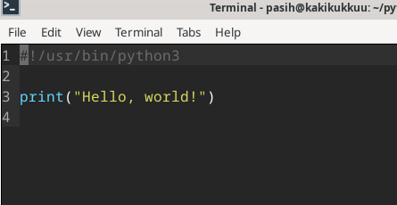
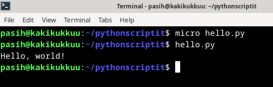
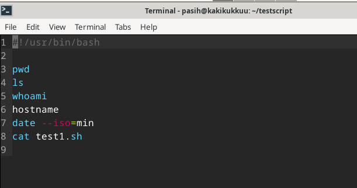
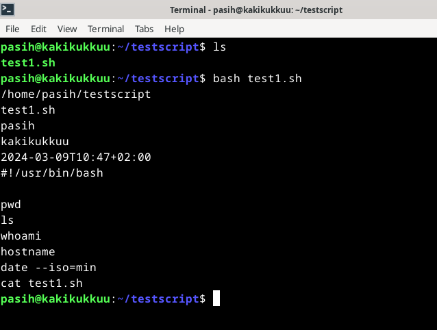
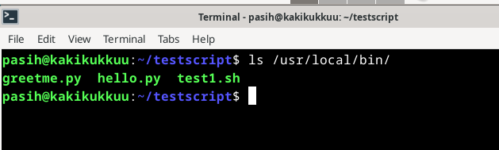
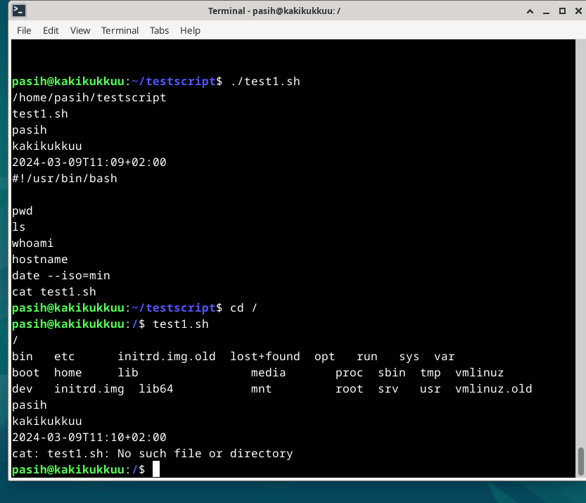

# Maalisuoralla !
Tällä viikolla on varsinainen viimeinen viikkotehtävä. Tehtävä sisältää 
- a) käännöksen "Hei maailma"
- b) Kaikilla käyttäjillä ajettavissa oleva komento 
- c) Vanhan labraharjoituksen rakaiseminen soveltuvin osin 
- d) Uuden virtuaalikoneen asennuksen ja päivittämisen sekä palomuurin asennuksen

## Käytössä oleva rauta
### Host OS
- Asus Tuf Gaming A15 FA506QM kannettava tietokone. Kone on tarkoitettu pelikäyttöön, ja on opiskeluolosuhteisiin ja tarkoitukseen nähden tehokas.
- Käyttöjärjestelmä: Windows 11 Home
- Prosessori: AMD Ryzen 7 5800H, 8 ydintä 3200GHz
- Muisti: 16 Gt
- Näytönohjain 6144Mt omalla muistilla
- Nettiyhteys taloyhtiön ethernet

### Guest OS
- Debian bookworm - VirtualBoxin kautta asennettu
- RAM 4096MB
- 4 Prosessoriydintä
- Kovalevy 50GB

# Työskentely 9.3.2024 klo 10:15-11:30
## a) Hei, maailma pythonilla
- `micro hello.py` -> loin tämän nimisen tiedoston kotihakemistooni. Kuvakaappauksessa lopputulos

- `#!/usr/bin/python3`
- `print("Hello, world!")`

 

## b) Ajettava komento kaikille käyttäjille. Käytän shelli scriptiä esimerkkiin
- `micro test1.sh` -> tiedosto kotihakemistoon. Scritpi sisältää kuvakaappauksen komennot
- `#!/usr/bin/bash` -> mahdollistaa scriptin ajon mistä tahansa
- `pwd` -> näyttää tämänhetkisen hakemistopolun
- `ls`-> listaa hakemistokansion sisällön
- `whoami` -> näyttää käyttäjän
- `hostname` -> näyttää tietokoneen nimen
- `date --iso=min` -> näyttää pvm ja kellonajan
- `cat test1.sh` -> tulostaa test1.sh tiedoston sisällön komentoriville

- `bash test1.sh` -> koklaillaan ensin hakemistossa miten toimii. Toimii

- `chmod ugo+x test1.sh` -> annetaan ajo-oikeus kaikille käyttäjille
- `sudo cp test1.sh` /usr/local/bin/` -> tiedoston siirto kansioon, josta se on ajettavissa kaikkialta
- `ls /usr/local/bin` -> tsekataan että siellä se on

- `./test1.sh` -> testataan vielä että scripti toimii. Toimii
- `test1.sh` -> kokeillaan vielä muulla hakemistopolulla, tässä tapauksessa rootissa. Toimii

